# Indonesia Food Price Intelligence (Big Data Dashboard)


> **Sistem Monitoring & Peringatan Dini Stabilitas Harga Pangan Nasional Berbasis Big Data & Machine Learning.**

---

## 📸 Preview Dashboard

<div align="center">
  
</div>

---

## 📖 Tentang Proyek

Proyek ini dikembangkan sebagai **Tugas Besar Mata Kuliah Big Data Analisis**. Aplikasi ini bertujuan untuk memecahkan masalah asimetri informasi di pasar pangan dengan menggabungkan data statistik pemerintah dan sentimen publik.

Menggunakan pendekatan **Big Data 4V** (Volume, Variety, Velocity, Veracity), sistem ini mengintegrasikan:
1.  **Data Terstruktur:** Harga harian komoditas (Beras, Cabai, Bawang) dari *PIHPS Nasional*.
2.  **Data Tidak Terstruktur:** Ribuan judul berita online yang di-scraping secara *real-time*.

### 🌟 Fitur Unggulan
| Fitur | Deskripsi Teknologi |
| :--- | :--- |
| **📈 Prediksi Harga (AI)** | Forecasting harga 30 hari ke depan menggunakan **Linear Regression**. |
| **🕸️ Analisis Isu (SNA)** | Memetakan *Keyword Co-occurrence* untuk mendeteksi penyebab kenaikan harga (e.g., "Gagal Panen", "Impor"). |
| **🗺️ Peta Geospasial** | Visualisasi sebaran harga komoditas di berbagai provinsi di Indonesia. |
| **🔄 Integrasi Data** | Pipeline otomatis pembersihan data (Cleaning & Preprocessing). |

---

## 🏗️ Arsitektur Sistem

Alur kerja data dari sumber mentah hingga menjadi visualisasi dashboard:

```mermaid
graph LR
    A[📡 Sumber Data] -->|Scraping| B(Google News)
    A -->|Download| C(PIHPS / BPS Excel)
    B --> D{Data Processing}
    C --> D
    D -->|Cleaning & Merging| E[Dataset Bersih]
    E --> F[🤖 Machine Learning Model]
    E --> G[🕸️ SNA Engine]
    F --> H((Streamlit Dashboard))
    G --> H

```



---

## 🛠️ Tech Stack

Project ini dibangun menggunakan ekosistem Python yang robust:

* **Core:** `Python 3.9+`
* **Web Framework:** `Streamlit` (UI/UX Interaktif)
* **Data Manipulation:** `Pandas`, `NumPy`
* **Machine Learning:** `Scikit-Learn` (Linear Regression)
* **Social Network Analysis:** `NetworkX`, `Matplotlib`
* **Data Ingestion:** `GoogleNews` (Web Scraping)

---

## 🚀 Cara Menjalankan (Installation)

Ingin mencoba menjalankannya di komputer lokal Anda? Ikuti langkah mudah ini:

### 1. Clone Repository

```bash
git clone https://github.com/MuhammadPrayoga/indonesia-food-price-prediction.git
cd indonesia-food-price-prediction

```

### 2. Setup Environment

Disarankan menggunakan virtual environment:

```bash
# Windows
python -m venv venv
venv\Scripts\activate

# Mac/Linux
python3 -m venv venv
source venv/bin/activate

```

### 3. Install Dependencies

```bash
pip install -r requirements.txt

```

### 4. Jalankan Aplikasi

```bash
streamlit run app.py

```

Buka browser dan akses: `http://localhost:8501`

---

## 📂 Struktur Direktori

```text
📦 indonesia-food-price-prediction
 ┣ 📂 data
 ┃ ┣ 📂 raw             # Data mentah (Excel/CSV asli)
 ┃ ┗ 📂 processed       # Data bersih hasil cleaning
 ┣ 📂 notebooks         # Dapur Analisis (Jupyter Notebook)
 ┃ ┣ 📜 1_cleaning.ipynb
 ┃ ┣ 📜 2_modeling.ipynb
 ┃ ┗ 📜 3_sna_analysis.ipynb
 ┣ 📜 app.py            # Main Application (Streamlit)
 ┣ 📜 requirements.txt  # Daftar Library
 ┗ 📜 README.md         # Dokumentasi ini

```

---

## 📊 Hasil Analisis (Insights)

Berdasarkan pengujian model:

* **Tren Harga:** Algoritma Linear Regression mampu membaca pola musiman harga Cabai dengan cukup baik.
* **Isu Pasar:** Melalui SNA, ditemukan bahwa kata kunci **"Operasi Pasar"** dan **"Stok Menipis"** memiliki *degree centrality* tertinggi, mengindikasikan korelasi kuat dengan lonjakan harga.

---

## 🤝 Kontribusi & Author

Project ini dibuat oleh:
**Alfian Nur Rizki**
**Agus Setiawan**
**Muhammad Prayoga**
Mahasiswa Teknik Informatika - Universitas Pelita Bangsa
---

*Disclaimer: Data yang digunakan bertujuan untuk keperluan akademis dan simulasi sistem Big Data.*

```

```
